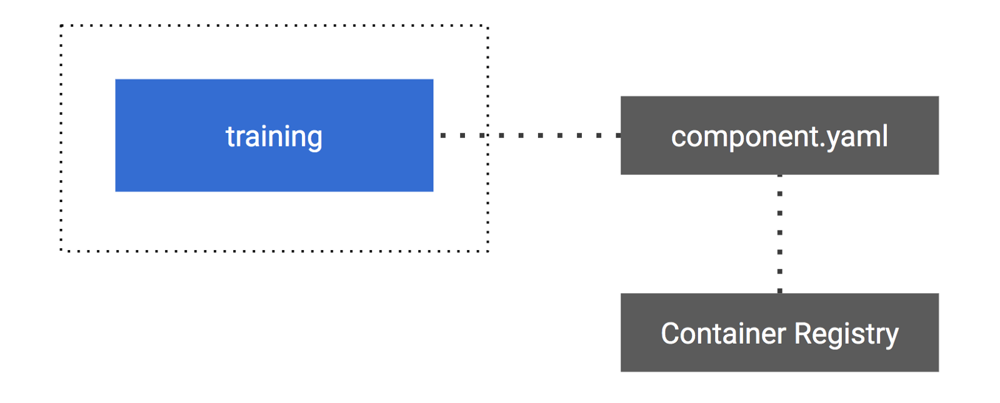

# Run the pipeline
If you are not familiar with pipelines have a look into the following article ["Kubeflow Components and Pipelines"](https://towardsdatascience.com/kubeflow-components-and-pipelines-33a1aa3cc338). 

## Open the Kubeflow Notebook
The pipeline can be created using our Jupyter notebook. For that, you have to create a Notebook in Kubeflow. 

Open the Jupyter notebook interface and create a new Terminal by clicking on menu, New -> Terminal. In the Terminal, clone this git repo by executing:

```bash
git clone https://github.com/kubeflow/examples.git
```

Now you have all the code required to run the pipeline. Navigate to the `examples/named-entity-recognition/notebooks` folder and open `Pipeline.ipynb`

## Configure the pipeline

The pipeline need several parameter in order to execute the components. After you set up all the parameter, run the notebook and click on the `Open experiment` link.

### Configure preprocess component

* `input_1_uri` - The input data csv
* `output_y_uri_template` - Output storage location for our preprocessed labels.
* `output_x_uri_template` - Output storage location for our preprocessed features.
* `output_preprocessing_state_uri_template` - Output storage location for our preprocessing state.

### Configure train component

* `input_x_uri` - Output of the previous pipeline step, contains preprocessed features.  
* `input_y_uri` - Output of the previous pipeline step, contains preprocessed labels.
* `input_job_dir_uri` - Output storage location for the training job files.
* `input_tags` - Output of the previous pipeline step, contains the number of tags.
* `input_words` - Output of the previous pipeline step, contains the number of words. 
* `output_model_uri_template` - Output storage location for our trained model. 


### Configure deploy component
* `model_path` - The model path is the output of the previous pipeline step the training. 
* `model_name` - The model name is later displayed in AI Platform.
* `model_region` - The region where the model sould be deployed.
* `model_version` - The version of the trained model. 
* `model_runtime_version` - The runtime version, in your case you used TensorFlow 1.13 .
* `model_prediction_class` - The prediction class of our custom prediction routine. 
* `model_python_version` - The used python version
* `model_package_uris` - The package which contains our custom prediction routine. 

## Whats happening in the notebook?
### Load the component
Components can be used in Pipelines by loading them from an URL. Everyone with access to the Docker repository can use these components.
The component can be loaded via components.load_component_from_url()

```python
preprocess_operation = kfp.components.load_component_from_url(
    'https://storage.googleapis.com/{}/components/preprocess/component.yaml'.format(BUCKET))
help(preprocess_operation)

train_operation = kfp.components.load_component_from_url(
    'https://storage.googleapis.com/{}/components/train/component.yaml'.format(BUCKET))
help(train_operation)

ai_platform_deploy_operation = comp.load_component_from_url(
    "https://storage.googleapis.com/{}/components/deploy/component.yaml".format(BUCKET))
help(ai_platform_deploy_operation)
```

Example based on the training component:

1. `kfp.components.load_component_from_url` loads the pipeline component.
2. You then have a operation that runs the container image and accepts arguments for the component inputs.



### Create the pipeline
The pipeline is created by defining a decorator.  The dsl decorator is provided via the pipeline SDK. `dsl.pipeline` defines a decorator for Python functions which returns a pipeline.

```python
@dsl.pipeline(
  name='Named Entity Recognition Pipeline',
  description='Performs preprocessing, training and deployment.'
)
def pipeline():
    ...
```

### Compile the pipeline
To compile the pipeline you use the `compiler.Compile()` function which is part of the pipeline SDK. 
The compiler generates a yaml definition which is used by Kubernetes to create the execution resources.

```python
pipeline_func = pipeline
pipeline_filename = pipeline_func.__name__ + '.pipeline.zip'

import kfp.compiler as compiler
compiler.Compiler().compile(pipeline_func, pipeline_filename)
```

### Create an experiment
Pipelines are always part of an experiment.
They can be created with the Kubeflow pipeline client `kfp.client()`. 
Experiments cannot be removed at the moment.

```python
client = kfp.Client()

try:
    experiment = client.get_experiment(experiment_name=EXPERIMENT_NAME)
except:
    experiment = client.create_experiment(EXPERIMENT_NAME)
```

### Run the pipeline
Use the experiment id and the compiled pipeline to run a pipeline. `client.run_pipeline()` runs the pipelines and provides a direct link to the Kubeflow experiment.

```python
arguments = {}

run_name = pipeline_func.__name__ + ' run'
run_result = client.run_pipeline(experiment.id, 
                                 run_name, 
                                 pipeline_filename, 
                                 arguments)
```

## Options to scale your training

> These are optional extenstions and outside of the scope of this example.

As default, training jobs are running within the CPU pool. 
If the dataset size or model complexity increases you have several options:

* Scale the training with AI Platform .
* Train in Kubeflow by enabling GPU or TPU on the ContainerOp.
* Converting the Keras model to a TensorFlow estimator and take advantage of distributed training.

*Next*: [Monitor the training](step-6-monitor-training.md)

*Previous*: [Custom prediction routine](step-4-custom-prediction-routine.md)